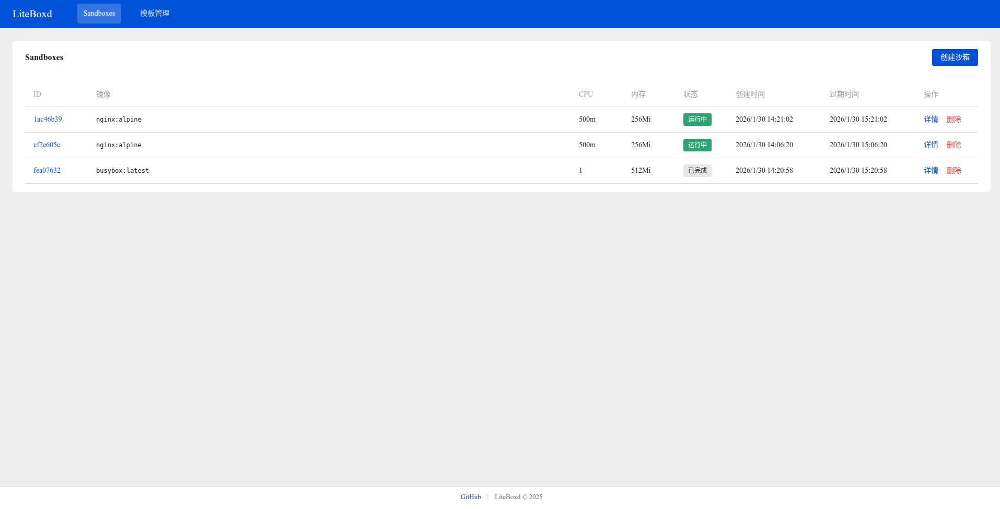
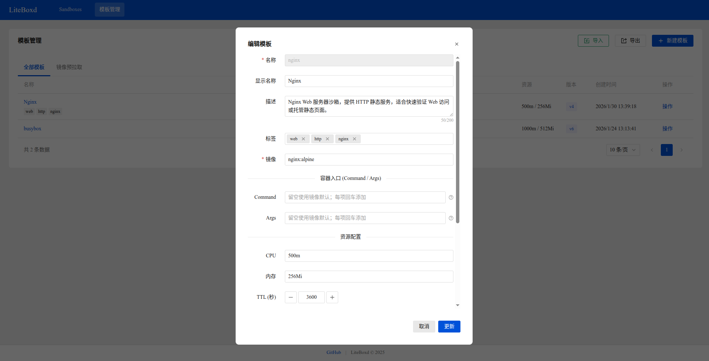

# LiteBoxd

A lightweight K8s sandbox system inspired by e2b, designed to run on k3s.

## Features

- Sandbox lifecycle management (create, list, get, delete)
- Command execution in sandboxes
- File upload/download
- Automatic TTL-based cleanup
- Web UI for easy management
- **Network isolation with Cilium** (ingress and egress control)
- **Token-based sandbox access** via gateway service
- **Configurable internet access** per template

## Screenshots

| Sandbox List | Template Management |
|:---:|:---:|
|  |  |

## Built-in Sandbox Templates

| Template | Description | Location |
|---|---|---|
| code-interpreter | Multi-language code execution environment with session and file operations | templates/code-interpreter.yml |
| nginx | Nginx web server sandbox | templates/nginx.yml |

## Quick Start

### Deploy LiteBoxd with Installer (Recommended)

For production-style deployment (install K3s + Cilium + LiteBoxd), use `liteboxd-installer`:

- [Deployment Guide](docs/user/deploy.md)

### Local Development

### Prerequisites

```bash
cd backend && go mod tidy
```

### 1. Prepare Remote K3s + Cilium

Deploy K3s and Cilium on a separate machine, and ensure this host can access the cluster.
Do not install K3s inside a Docker container.

See: https://docs.cilium.io/en/stable/installation/k3s/

### 2. Configure Kubeconfig

Copy the kubeconfig from the remote machine to this host and set the environment variable:

```bash
export KUBECONFIG=~/.kube/config
```

### 3. Start Backend

```bash
make run-backend
```

The API server will start on `http://localhost:8080`.

### 4. Start Gateway

```bash
make run-gateway
```

The gateway server will start on `http://localhost:8081`.

### 5. Start Frontend

```bash
make run-frontend
```

The web UI will be available at `http://localhost:3000`.

### All-in-One

Run all services:

```bash
make run-all
```

> **Tip**: Run `make help` to see all available commands.
> **See also**: [Network Access Guide](docs/network-access-guide.md) for network feature documentation.

## Security

- Privilege escalation is disabled
- Resource limits prevent resource exhaustion
- All sandboxes run in dedicated namespace
- Seccomp profile enabled
- **Default-deny network policies** (Cilium)
- **Token-based authentication** for sandbox access
- **Sandbox isolation from K8s API Server**

## License

[GPL-3.0](LICENSE)
